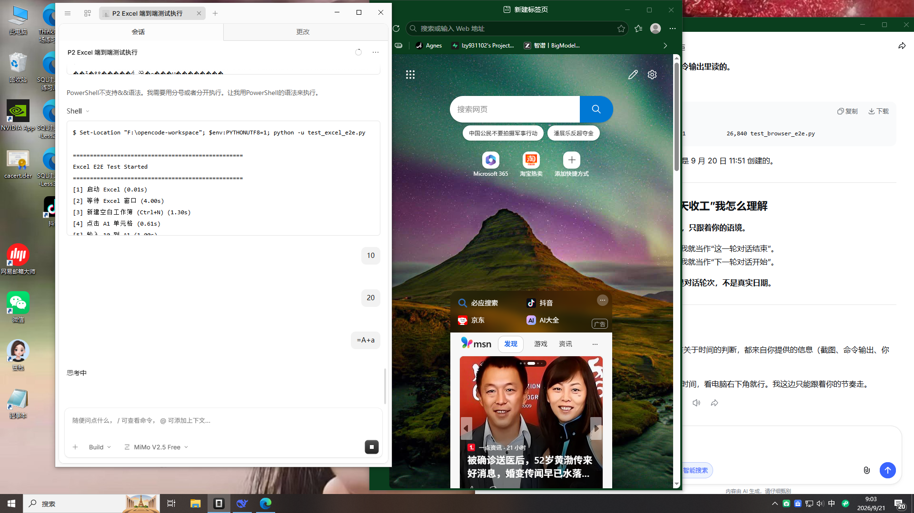

# Desktop Agent




一个模块化的 Windows 桌面操作 Agent，支持截屏感知、OCR 识别、图像检测、鼠标点击、键盘输入等自动化操作。

## 功能特性

- **截屏感知** - 使用 mss + OpenCV 实时捕获屏幕
- **OCR 文字识别** - Tesseract 中英文识别
- **图像识别** - HSV 颜色检测定位目标
- **多模态理解** - Qwen2.5-VL 视觉语言模型
- **图像定位** - pyautogui.locateOnScreen 模板匹配
- **鼠标控制** - ctypes 精确点击
- **键盘输入** - pyautogui 模拟按键
- **剪贴板操作** - pyperclip 复制粘贴
- **COM 接口** - WPS/Office 自动化
- **UIA 元素定位** - Windows UI Automation
- **安全拦截** - 分级权限 + 白名单
- **异常恢复** - 自动错误处理

## 架构

```
┌─────────────────────────────────────────────────────────┐
│                    Orchestrator (调度层)                  │
├─────────────────────────────────────────────────────────┤
│  Perception   │   Brain    │  Actuator  │   Verifier    │
│  (感知层)      │  (决策层)   │  (执行层)   │   (验证层)    │
├─────────────────────────────────────────────────────────┤
│              Memory (记忆层)    │   Security (安全层)     │
└─────────────────────────────────────────────────────────┘
```

### 模块说明

| 模块 | 职责 |
|------|------|
| Perception | 截屏、OCR、图像识别 |
| Brain | 任务规划、决策推理 |
| Actuator | 鼠标、键盘、COM 操作 |
| Verifier | 结果验证、状态检查 |
| Memory | 文件存储、任务状态 |
| Security | 权限控制、安全拦截 |
| Orchestrator | 模块协调、任务调度 |

## 快速开始

### 安装依赖

```bash
pip install -r requirements.txt
```

额外依赖（可选）：

```bash
pip install mss pytesseract pyperclip pywin32 uiautomation
```

### 运行测试

```bash
# 移动靶测试
python test_moving_target.py

# 记事本 E2E
python test_notepad_e2e.py

# 计算器 E2E
python test_calculator_e2e.py

# 浏览器 E2E
python test_browser_e2e.py
```

## 测试结果

| 编号 | 测试项 | 结果 |
|------|--------|------|
| T1 | 移动靶预判 | ✅ |
| T2 | 多靶子决策 | ✅ 100% |
| T3 | 弹窗干扰 | ✅ 10/10 |
| T4 | 分辨率变化 | ✅ 6/6 |
| T5 | 记事本 E2E | ✅ |
| T6 | 计算器 E2E | ✅ |
| T7 | 浏览器 E2E | ✅ |
| T8 | 连续 10 局稳定性 | ✅ |
| T9 | 异常恢复 | ✅ 4/4 |
| T10 | 安全拦截 | ✅ 14/14 |
| T11 | 任务链 | ✅ 11/11 |
| P2-1 | Excel（WPS） | ✅ 7.89s |
| P2-2 | Word（WPS） | ✅ 11.29s |
| P2-3 | PPT（WPS） | ✅ 9.28s |
| P2-1 | Excel（WPS） | ✅ 4.37s |
| P2-2 | Word（WPS） | ✅ 4.64s |
| P2-3 | PPT（WPS） | ✅ 6.41s |
| P3 | 文件夹操作 | ✅ 24.95s |
| P4 | AI 决策（LM Studio） | ✅ 18.56s |
| P7 | 批量文件（GUI） | ✅ 15.82s |
| P8 | 多模态升级 | ✅ 4/4 |

## 技术栈

| 组件 | 技术选择 |
|------|----------|
| 截屏 | mss |
| OCR | Tesseract |
| 图像处理 | OpenCV |
| 多模态 | Qwen2.5-VL |
| 图像定位 | pyautogui.locateOnScreen |
| 鼠标控制 | ctypes |
| 键盘模拟 | pyautogui |
| 剪贴板 | pyperclip |
| COM 自动化 | pywin32 |
| UI 自动化 | uiautomation |

## 项目结构

```
desktop-agent/
├── agent/                    # 核心模块
│   ├── modules/             # 功能模块
│   │   ├── perception/      # 感知层
│   │   ├── cognition/       # 认知层
│   │   └── ...
│   ├── main.py              # 入口
│   └── scheduler.py         # 调度器
├── test_*.py                # 测试文件
├── requirements.txt         # 依赖
├── LICENSE                  # MIT License
└── README.md                # 项目说明
```

## 参考项目

- [Self-Operating Computer](https://github.com/OpenAdenAI/self-operating-computer)
- [je-auto-control](https://github.com/jeauto-control/je-auto-control)
- [OpenWorker](https://github.com/OpenWorkerAI/OpenWorker)
- [GhostDesk](https://github.com/GhostDesk/GhostDesk)
- [ScreenAgent](https://github.com/niuzaishen/ScreenAgent)

## 许可证

[MIT License](LICENSE)
